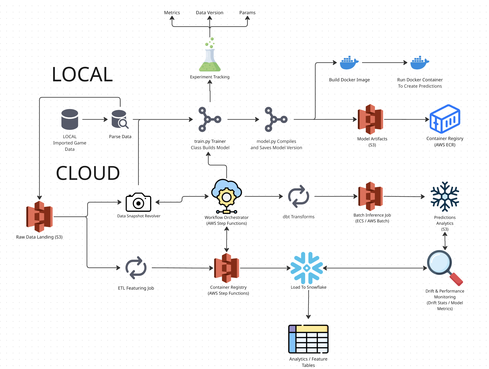

# LoL ML Pipeline

## Problem

Predict the probability that a professional League of Legends team will win a match using **only information available before the game begins**, including team and player identity, draft picks and bans, side selection, and patch-level context.

The project explicitly avoids post-game statistics and outcome-derived features to prevent label leakage.

---

## Project Goal

Build a **production-oriented machine learning pipeline** that mirrors how real ML systems are designed and operated, with an emphasis on:

- clean and deterministic data handling  
- explicit feature definition  
- reproducible training and evaluation  
- extensibility toward cloud deployment, monitoring, and retraining  

This repository prioritizes **system design and workflow correctness** over short-term model performance.

---

## Workflow

The end-to-end pipeline follows the workflow below, spanning local development and cloud execution:

At a high level, the system:
- ingests and versions raw competitive match data  
- performs deterministic feature engineering  
- resolves immutable dataset snapshots for training  
- tracks experiments, parameters, and metrics  
- versions and stores model artifacts  
- runs containerized training and batch inference in the cloud  
- loads features and predictions into Snowflake for analytics  
- monitors model performance and data drift to support retraining

---

## Status

This project is under active development.  
The current focus is on solidifying the data and workflow foundations before expanding into advanced modeling and deployment strategies.
